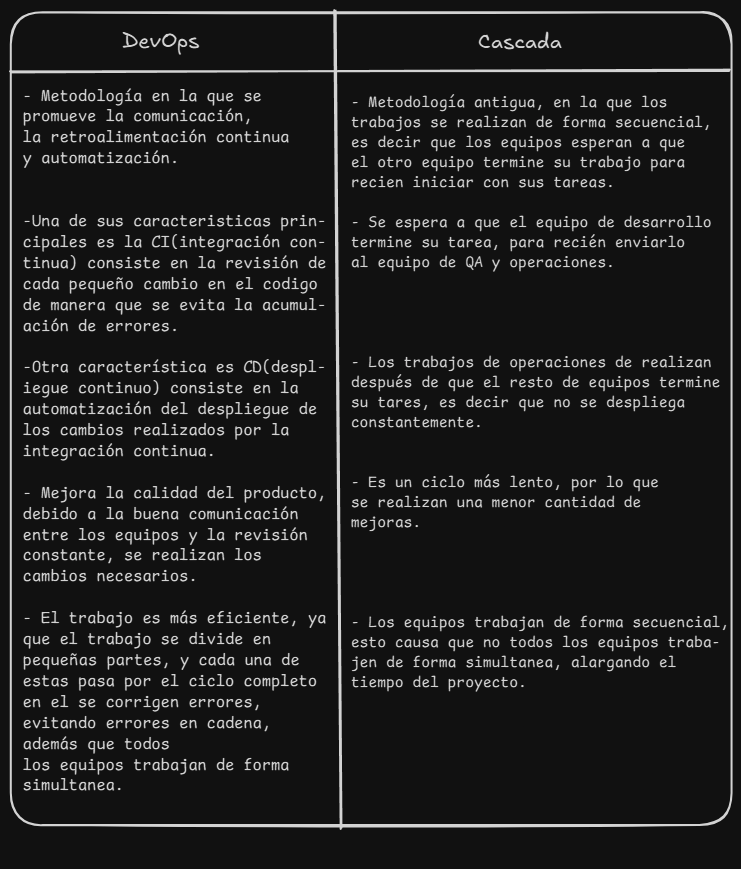
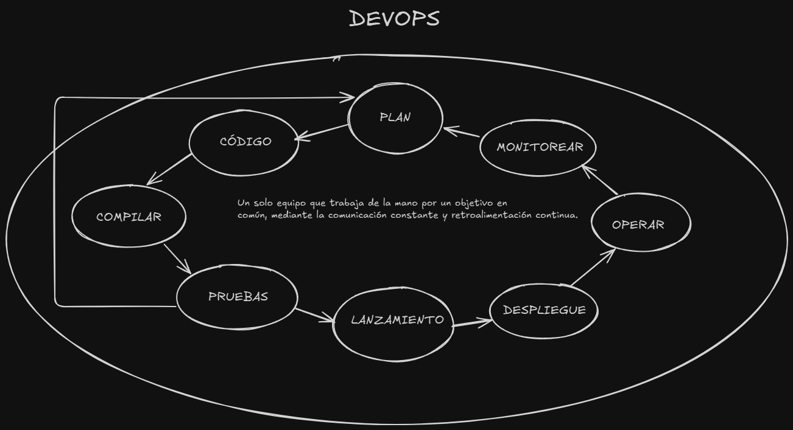
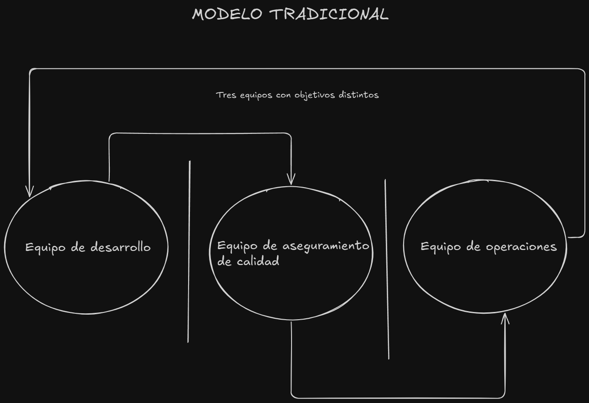

# Actividad 1 - Sergio Quesada
# Tiempo invertido: 01:00

## Devops vs. cascada tradicional 
### Imagen comparativa

### ¿Por qué DevOps acelera y reduce riesgo en software para la nube frente a cascada?
Porque devops usa herramientas de automatización y gestión de contenedores en el que ejecutan los microservicios, la integración de nuevo código y su despliegue (CI/CD) en la nube es adecuado ya que nos brindan servicios basados en tecnologías como kubernetes y docker. Nos permiten hacer pruebas de escalabilidad y rendimiento
con un costo proporcional. En cuanto a la metodología de cascada, tendríamos que esperar a que el equipo de desarrollo termine el trabajo para recien desplegarlo en la nube de forma completa.
### Contexto real donde un enfoque cercano a cascada sigue siendo razonable
Un software para registrar participantes y presentaciones de un evento, no requiere actualización continua, ya que es solo un evento y las funcionalidades son pocas y claramente definidas.