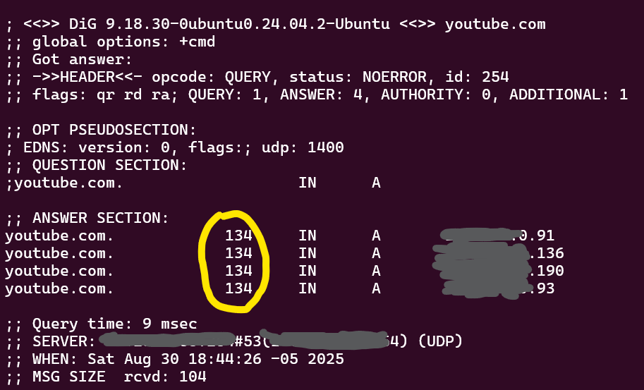

# Actividad 1 - Sergio Quesada
# Tiempo invertido: 05:30

## Devops vs. cascada tradicional 
### Imagen comparativa

### ¿Por qué DevOps acelera y reduce riesgo en software para la nube frente a cascada?
Porque devops usa herramientas de automatización y gestión de contenedores en el que ejecutan los microservicios, la integración de nuevo código y su despliegue (CI/CD) en la nube es adecuado ya que nos brindan servicios basados en tecnologías como kubernetes y docker. Nos permiten hacer pruebas de escalabilidad y rendimiento
con un costo proporcional. En cuanto a la metodología de cascada, tendríamos que esperar a que el equipo de desarrollo termine el trabajo para recien desplegarlo en la nube de forma completa.
### Contexto real donde un enfoque cercano a cascada sigue siendo razonable
Un software para registrar participantes y presentaciones de un evento, no requiere actualización continua, ya que es solo un evento y las funcionalidades son pocas y claramente definidas.
## Ciclo tradicional de dos pasos y silos (limitaciones y anti-patrones)
### Silos organizacionales

### Limitaciones
- El equipo de software entrega una gran cantidad de material y se lava las manos, esto dificulta la tarea del equipo de operaciones.
- Al no existir una retroalimentación continua, los errores se acumulan hasta llegar a la siguiente fase provocando retrasos, más trabajo y aumentando los costos. La alta cantidad de problemas provoca un mayor tiempo de recuperación.
### Define dos anti-patrones ("throw over the wall", seguridad como auditoría tardía) y explica cómo agravan incidentes (mayor MTTR, retrabajos, degradaciones repetitivas).
**throw over the wall** se refiere a lanzar el material hacía el otro equipo, como si existiese un muro, una barrera de comunicación en el que si a un equipo le funciona, entonces su trabajo ha terminado y el resto es responsabilidad del otro equipo. Los fallos que se producen en operaciones tardan mucho más en corregirse(mayor MTTR) y devuelven el material al equipo de desarrollo que tiene que volver a trabajar para corregir errores que pudieron haberse detectado de forma temprana.
**seguridad como auditoría tardía**, en el enfoque tradicional los análisis de seguridad se realizan al final del proyecto, esto produce la detección de fallos de seguridad que son más costosos de reparar ya que estamos delante de un proyecto ya integrado, el enfoque devsecops los analisis de seguridad y buenas prácticas se realizan de forma continua.
## Principios y beneficios de DevOps (CI/CD, automatización, colaboración; Agile como precursor)
### CI/CD
CI es la integración continua, cada que se agrega nuevo código, este se compila y es sometido a una serie de pruebas automatizadas(unitarias y de integración). Luego de comprobar la funcionalidad de los cambios recién se integran las ramas. CD es la entrega continua, consiste comprobar que la aplicación este lista para ser entregada al cliente, para esto se realiza el despliegue de la aplicación en un entorno de producción para observar como afectan los factores ambientales al desempeño de la aplicación, es decir si se generan errores o se reduce el rendimiento.
### Prácticas agiles
Las reuniones diarias sirven para que cada miembro del equipo comparta información actualizada sobre su trabajo y sus siguientes pasos, esto sirve para que los miembros comprendan y ayuden a solucionar y prevenir los problemas de sus compañeros, además de estar preparados para las nuevas tareas que les correspondan al día siguiente.
### Indicador observable (no financiero) para medir mejora de colaboración Dev-Ops
**Proporción de rollbacks sin downtime**, Un rollback es el proceso retorno a la última versión estable de la aplicación, cuando se despliega una nueva versión pueden surgir problemas. Se debe realizar este proceso cumpliendo un conjunto de condiciones para considerarlos 'sin downtime' (latencia controlada, disponibilidad, tasa de errores estables, etc). Estas características son observables y se pueden registrar, al final del proceso se verifica si se cumplieron con las condiciones y se determina si hubo downtime. Una mayor cantidad de rollbacks sin downtime indica una buena colaboración entre desarrollo y operaciones.
## Evolución a DevSecOps (seguridad desde el inicio: SAST/DAST; cambio cultural)
### Diferencia entre SAST y DAST
Sast es el análisis del código recién agregado, no se compila, sino que se revisa el código en busca de malas prácticas, como el uso de funciones inseguras, no proteger las entradas del usuario, exponer datos, etc. Se ubica antes de la integración continua.
Dast es el análisis del proyecto desplegado, se detectan vulnerabilidades haciendo distintas pruebas desde la aplicación en ejecución. Es la situación en la que se encuentra un atacante real, por lo que en esta fase trabaja el red team(un equipo que se encarga de explotar las vulnerabilidades y hacer reportes).Se ubica en la fase de entrega continua, las pruebas se realizan al desplegar el proyecto en un entorno de prueba.
### Define un gate mínimo de seguridad con dos umbrales cuantitativos (por ejemplo, "cualquier hallazgo crítico en componentes expuestos bloquea la promoción"; "cobertura mínima de pruebas de seguridad del X%").
- Cualquier hallazgo de exposición de componentes bloquea la promoción, por ejemplo una api para iniciar sesión expuesta puede ser utilizada para obtener credenciales usando fuerza bruta.
- Cobertura mínima de pruebas de seguridad del 80%.
### Política de excepción
Se admitiran una cobertura mínima de pruebas en SAST <80% si existe una limitación de tiempo relacionada con la entrega del producto al cliente.
- Caducidad: 1 semana.
- Responsable: Encargado del area de ciberseguridad del proyecto.
- Plan de corrección: Realizar las pruebas necesarias para cubrir los requerimientos mínimos durante el plazo de tiempo concedido.
### ¿cómo evitar el "teatro de seguridad" (cumplir checklist sin reducir riesgo)? Propón dos señales de eficacia (disminución de hallazgos repetidos; reducción en tiempo de remediación) y cómo medirlas.
Lo principal sería concientizar a los miembros del equipo a través de talleres y charlas relacionadas a la seguridad y buenas prácticas, se debe designar a un encargado en el area de seguridad que sea responsable por verificar el trabajo de los miembros de su área y garantizarles las herramientas adecuadas.
Señales de eficacia:
- Reducción en el tiempo de la fase de agregar nuevo código, al capacitar e informar a los desarrolladores sobre las buenas prácticas el hallazgo de vulnerabilidades en el SAST se reducira evitando la devolución y corrección.
- Reducción en el tiempo de remediación, al tener personal capacitado los tiempos de reparación es menor que al tener a personal con menos nivel.
## CI/CD y estrategias de despliegue (sandbox, canary, azul/verde)
El despliegue canario consiste en conducir un pequeña fracción del tráfico hacia la nueva versión de la aplicación,
si no se detectan fallos se realiza la transición de forma gradual.

### Canary para un servicio de autenticación
Despliegue canario par el microservicio de autenticación, se elige esta estrategia porque la autenticación es una funcionalidad fundamental para la aplicación, si existen errores se limitarán a un pequeño porcentaje de clientes afectados y el proceso de rollback es rápido.
### Riesgos vs. mitigaciones
|Riesgo    |Mitigación    |
|----------|--------------|
|Manejo de sesiones|Limitar el inicio de sesión sin cortar las sesiones activas, dejar que se cierren por si solas para evitar errores|
|Costo operativo de dos versiones| Limitar el tiempo de prueba hasta la migración total|
|Pérdida de datos|Crear backups antes de la migración|
|Aparición de vulnerabilidades|Ejecutar DAST para identificar y reparar las vulnerabilidades|
### KPI primario
Es un indicador de rendimiento, se usa para tomar decisiones sobre el despliegue.
En el caso del microservicio de autenticación podemos cuantizar la tasa de errores 5xx( errores del servidor ).
Definimos la tasa de errores 5xx < 0.5% durante la primera hora, en caso de superar el límite iniciamos el proceso de rollback.
### Si el KPI técnico se mantiene, pero cae una métrica de producto (conversión), explica por qué ambos tipos de métricas deben coexistir en el gate.
Por que la experiencia del usuario es más importante, el producto puede ser técnicamente funcional pero problemático para el cliente, si ignoramos estás métricas el proyecto va a fracasar.
## Fundamentos prácticos
### HTTP - contrato observable

Método GET, código de estado 200.
Cabeceras:
- Alt-Svc, indica que el servidor soporta HTTP/3 por el puerto 443.El cliente puede recordar esta información por 86400 segundos.
- Cache-control, private indica que solo el cliente puede cachear la respuesta, no los intermediarios; no-cache, el cliente debe revalidar con el servidor antes de reutilizarla; no-store, indica que no se debe almacenar en la cache; must-revalidate, cuando la respuesta expire el cliente debe volver a consultar al servidor.
- Content-Encoding, indica el algoritmo de compresión usado en el cuerpo.
### DNS - nombres y TTL

Tipo de registro: A, TTL: 134.
Un TTL alto afecta al proceso de rollback ya que la dirección ip de la versión inestable permanecerá más tiempo en la cache del servidor, a pesar de que el cambio de ip ya se haya realizado, los usuarios seguirán siendo dirigidos a la dirección de la versión inestable ya que el resolver mantiene esa dirección durante el tiempo que señala el TTL. Un TTL bajo agiliza el proceso de rollback, pero a la vez aumenta el tráfico al servidor DNS.
### TLS - seguridad en tránsito

Si no se valida la cadena significa que no se pudo seguir la secuencia de validaciones hasta el CA root, una autoridad de certicación raiz confiable, el navegador notifica al usuario que el sitio no es confiable, existe el riesgo de ataque MITM(Man in the middle), que sucede cuando un tercero intercepta el tráfico. Además las alertas del navegador generan desconfianza en el usuario final, por lo tanto el uso de la aplicación se reduce.
### Puertos - estado de runtime

- puerto 53: puerto estandar en el que corre el servicio DNS.
- puerto 443: puerto estandar para https, en este caso esta corriendo nginx.
Podemos utilizar la enumeración de puertos para verificar que todos los servicios que estamos ofreciendo están corriendo en sus respectivos puertos, además de verificar que los puertos que vamos a usar antes del despliegue no estén ocupados.
### 12-Factor - port binding, configuración, logs
Para parametrizar el puerto sin incluirlo en el código, podemos usar variables de entorno, la variable de entorno contiene el número de puerto y en el código solo haríamos referencia al nombre de la variable.
Los logs se ven a través del stdout/stderr al ejecutar la aplicación, no se deben almacenar en archivos locales, se capturan y se redirigen, ya que tenerlos en local es problemático, ocupan espacio, pueden perderse, dificulta la escalabilidad y el análisis.
Un antipatrón sería los datos de configuración en el código, genera inconsistencias ya que tendríamos que crear distintos builds para cada entorno. Según 12-factor el compilado debería ser único y los datos de configuración se controlan en el entorno.
### Checklist de diagnóstico (incidente simulado)
- Contrato http: Revisar los logs en búsqueda de errores 4xx/5xx, revisar si los endpoints responden de forma correcta. Al conocer estos errores se puede rastrear el origen del problema.
- Resolución DNS inconsistente: Se realiza la solicitud al Servidor DNS desde distintas redes en busca de inconsistencias.
- Certificado TLS caducado o incorrecto: Revisar que el certificado no esté caducado, en caso de que haya expirado solo tendríamos que renovarlo.
- Puerto mal configurado: Revisar que el servicio esté expuesto en el puerto correspondiente, en caso de que el puerto no esté ofreciendo el servicio debemos reiniciarlo.
## Desafíos de DevOps y mitigaciones

