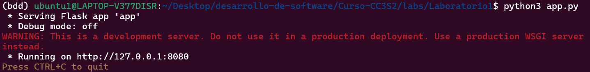

## 1) HTTP: Fundamentos y herramientas
### Levanta la app con variables de entorno (12-Factor):
Declaramos las variables de entorno en app.py:
```python
# 12-Factor: configuración vía variables de entorno (sin valores codificados)
PORT = int(os.environ.get("PORT", "8080"))
MESSAGE = os.environ.get("MESSAGE", "Hola CC3S2")
RELEASE = os.environ.get("RELEASE", "v1")
```
