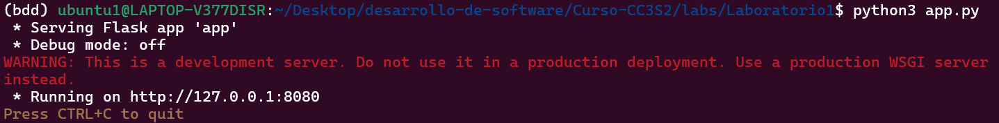
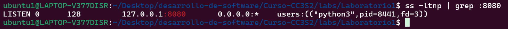
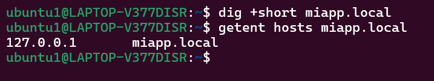
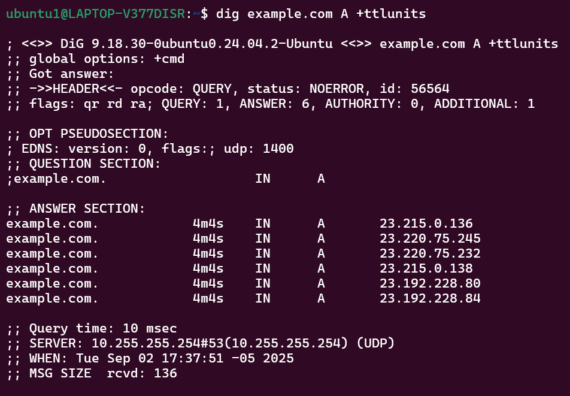
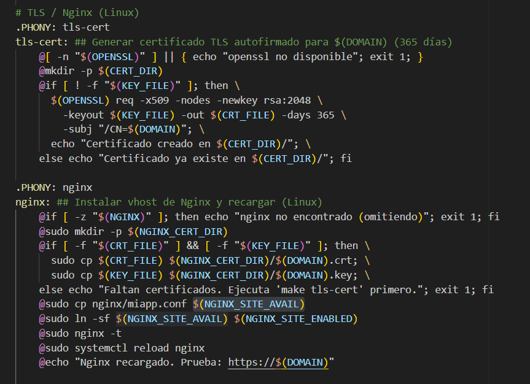
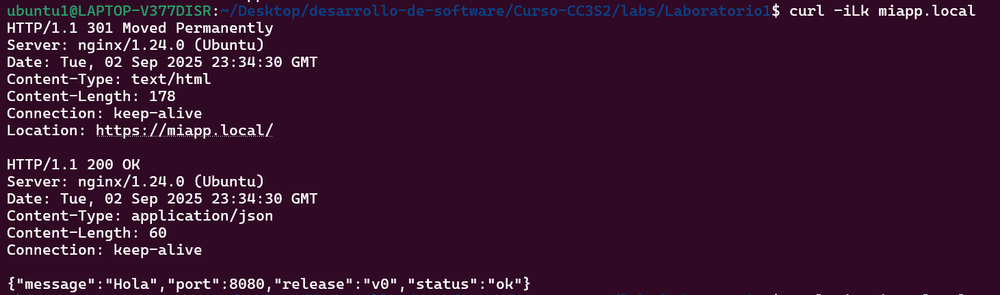
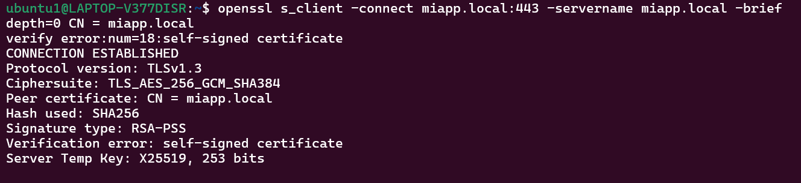
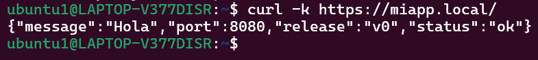
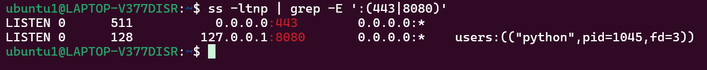

## 1) HTTP: Fundamentos y herramientas
### Levanta la app con variables de entorno (12-Factor):
Declaramos las variables de entorno en app.py:
```python
# 12-Factor: configuración vía variables de entorno (sin valores codificados)
PORT = int(os.environ.get("PORT", "8080"))
MESSAGE = os.environ.get("MESSAGE", "Hola CC3S2")
RELEASE = os.environ.get("RELEASE", "v1")
```

### Inspección con curl
Al usar el parámetro -v de curl, obtenemos los detalles de la petición HTTP.

Al usar el parámetro -X POST estamos haciendo una petición con el método POST, como el servidor está configurado para recibir peticiones por GET, devuelve un código de estado 405(METHOD NOT ALLOWED).

¿Qué campos de respuesta cambian si actualizas MESSAGE/RELEASE sin reiniciar el proceso? 
No cambia ningun campo porque la app ya está compilada, para que observar los cambios tendríamos compilar el script modificado.
### Puertos abiertos con ss

### Logs como flujo
Los logs se muestran a través del stdout/stderr, no se escriben en un archivo local, se redirigen a un lugar en común para el análisis y monitoreo.
```
[INFO] GET /  message=Hola CC2S3 release=v1
127.0.0.1 - - [02/Sep/2025 14:47:28] "GET / HTTP/1.1" 200 -
127.0.0.1 - - [02/Sep/2025 14:48:25] "POST / HTTP/1.1" 405 -
[INFO] GET /  message=Hola CC2S3 release=v1
127.0.0.1 - - [02/Sep/2025 14:51:15] "GET / HTTP/1.1" 200 -
[INFO] GET /  message=Hola CC2S3 release=v1
127.0.0.1 - - [02/Sep/2025 14:51:45] "GET / HTTP/1.1" 200 -
```
## 2) DNS: nombres, registros y caché
### Hosts local: agrega 127.0.0.1 miapp.local (Linux y/o Windows según tu entorno). Usa el target de la guía si está disponible (make hosts-setup).
Agregamos la linea ``127.0.0.1 miapp.local` al archivo /etc/hosts.
### Comprueba resolución

Al usar el comando dig no obtenemos respuesta, esto sucede porque la herramienta dig no consulta al archivo /etc/hosts, consulta directamente a un servidor DNS. En cambio el comando getent consulta los archivos definidos en /etc/nsswitch.conf.
### TTL/caché

Observamos que las respuestas no se repiten, el TTL es el tiempo que el servidor DNS guarda la asociación(dominio-ip) antes de volver a consultar al servidor autoritativo, los servicios grandes van rotando un conjunto de ips un TTL bajo aumenta la frecuencia de uso y puede provocar ips repetidas.
### ¿Qué diferencia hay entre /etc/hosts y una zona DNS autoritativa? ¿Por qué el hosts sirve para laboratorio?
El /etc/hosts es un archivo local al cual podemos consultar antes que un servidor DNS, una zona DNS autoritativa sirve para resolver dominios en la red, es util para todos los hosts conectados a la red. El /etc/hosts nos sirve porque estamos corriendo el servicio de forma local. 
## 3) TLS: seguridad en tránsito con Nginx como reverse proxy
### Certificado laboratorio

Generamos la llave y obtenemos el certificado con openssl, copiamos el certificado y la llave al directorio que usa nginx: /etc/ssl/miapp.
### Configuración nginx
Fragmento de miapp.conf:
```
location / {
    proxy_pass http://127.0.0.1:8080;
    proxy_set_header Host $host;
    proxy_set_header X-Forwarded-For $remote_addr;
    proxy_set_header X-Forwarded-Proto https;
  }
```

### Valida el handshake

El parametro `-k` de curl sirve para ignorar los errores en relación al certificado, en nuestro caso tenemos un certificado autofirmado.

### Puertos y logs

Al ejecutar el comando `journalctl -u nginx -n 50 --no-pager` podemos ver las ultimas lineas los logs del servicio de nginx.
Algunas lineas:
```
Aug 27 17:52:13 LAPTOP-V377DISR systemd[1]: Reloaded nginx.service - A high performance web server and a reverse proxy server.
Aug 30 17:50:25 LAPTOP-V377DISR systemd[1]: Starting nginx.service - A high performance web server and a reverse proxy server...
Aug 30 17:50:25 LAPTOP-V377DISR systemd[1]: Started nginx.service - A high performance web server and a reverse proxy server.
Aug 30 17:53:11 LAPTOP-V377DISR systemd[1]: Stopping nginx.service - A high performance web server and a reverse proxy server...
Aug 30 17:53:11 LAPTOP-V377DISR systemd[1]: nginx.service: Deactivated successfully.
```