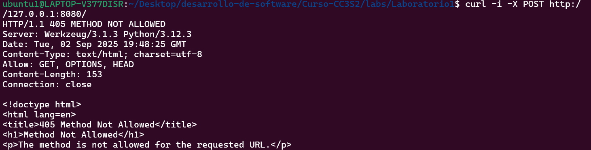

## 1) HTTP: Fundamentos y herramientas
### Levanta la app con variables de entorno (12-Factor):
Declaramos las variables de entorno en app.py:
```python
# 12-Factor: configuración vía variables de entorno (sin valores codificados)
PORT = int(os.environ.get("PORT", "8080"))
MESSAGE = os.environ.get("MESSAGE", "Hola CC3S2")
RELEASE = os.environ.get("RELEASE", "v1")
```

### Inspección con curl
Al usar el parámetro -v de curl, obtenemos los detalles de la petición HTTP.

Al usar el parámetro -X POST estamos haciendo una petición con el método POST, como el servidor está configurado para recibir peticiones por GET, devuelve un código de estado 405(METHOD NOT ALLOWED).

¿Qué campos de respuesta cambian si actualizas MESSAGE/RELEASE sin reiniciar el proceso? 
No cambia ningun campo porque la app ya está compilada, para que observar los cambios tendríamos compilar el script modificado.
### Puertos abiertos con ss

### Logs como flujo
Los logs se muestran a través del stdout/stderr, no se escriben en un archivo local, se redirigen a un lugar en común para el análisis y monitoreo.
```
[INFO] GET /  message=Hola CC2S3 release=v1
127.0.0.1 - - [02/Sep/2025 14:47:28] "GET / HTTP/1.1" 200 -
127.0.0.1 - - [02/Sep/2025 14:48:25] "POST / HTTP/1.1" 405 -
[INFO] GET /  message=Hola CC2S3 release=v1
127.0.0.1 - - [02/Sep/2025 14:51:15] "GET / HTTP/1.1" 200 -
[INFO] GET /  message=Hola CC2S3 release=v1
127.0.0.1 - - [02/Sep/2025 14:51:45] "GET / HTTP/1.1" 200 -
```

