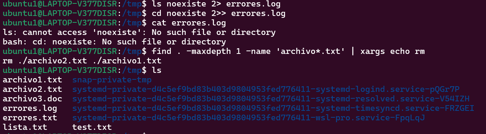

## Manejo sólido de CLI
Ejercicios de reforzamiento
1. Navega a /etc, lista archivos ocultos y redirige la salida a un archivo en tu home: cd /etc; ls -a > ~/etc_lista.txt.

2. Usa globbing para listar todos los archivos en /tmp que terminen en .txt o .doc, y cuenta cuántos hay con una tubería (versión robusta): `find /tmp -maxdepth 1 -type f \( -name '*.txt' -o -name '*.doc' \) | wc -l.`

3. Crea un archivo con `printf "Línea1\nLínea2\n" > test.txt`.

4. Redirige errores de un comando fallido (ej. ls noexiste) a un archivo y agrégalo a otro: ls noexiste 2>> errores.log. Para borrados con xargs, primero haz un dry-run: `find . -maxdepth 1 -name 'archivo*.txt' | xargs echo rm`.

Comprobación

