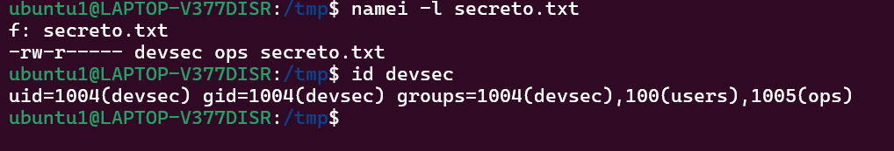

## Manejo sólido de CLI
Ejercicios de reforzamiento
1. Navega a /etc, lista archivos ocultos y redirige la salida a un archivo en tu home: cd /etc; ls -a > ~/etc_lista.txt.

2. Usa globbing para listar todos los archivos en /tmp que terminen en .txt o .doc, y cuenta cuántos hay con una tubería (versión robusta): `find /tmp -maxdepth 1 -type f \( -name '*.txt' -o -name '*.doc' \) | wc -l.`

3. Crea un archivo con `printf "Línea1\nLínea2\n" > test.txt`.

4. Redirige errores de un comando fallido (ej. ls noexiste) a un archivo y agrégalo a otro: ls noexiste 2>> errores.log. Para borrados con xargs, primero haz un dry-run: `find . -maxdepth 1 -name 'archivo*.txt' | xargs echo rm`.

Comprobación

## Administración básica
Ejercicios de reforzamiento
1. Crea un usuario "devsec" y agrégalo a un grupo "ops". Cambia permisos de un archivo para que solo "devsec" lo lea: `sudo adduser devsec; sudo addgroup ops; sudo usermod -aG ops devsec; touch secreto.txt; sudo chown devsec:ops secreto.txt; sudo chmod 640 secreto.txt` (usa mock si es entorno compartido).

2. Lista procesos, encuentra el PID de tu shell (`ps aux | grep bash`), y envía una señal SIGTERM (no lo mates si es crítico).

3. Verifica el estado de un servicio como "systemd-logind" con `systemctl status systemd-logind`, y ve sus logs con `journalctl -u systemd-logind -n 10`.

4. Inicia un proceso en background (`sleep 100 &`), lista con `ps`, y mátalo con `kill`.

Comprobación

## Utilidades de texto de Unix
Ejercicios de reforzamiento
1. Usa grep para buscar "root" en /etc/passwd: `grep root /etc/passwd`.
2. Con sed, sustituye "dato1" por "secreto" en datos.txt: `sed 's/dato1/secreto/' datos.txt > nuevo.txt`.
3. Con awk y cut, extrae usuarios de /etc/passwd: `awk -F: '{print $1}' /etc/passwd | sort | uniq`.

4. Usa tr para convertir un texto a mayúsculas y tee para guardarlo: `printf "hola\n" | tr 'a-z' 'A-Z' | tee mayus.txt`.
5. Encuentra archivos en /tmp modificados en los últimos 5 días: `find /tmp -mtime -5 -type f`.

6. Pipeline completo: `ls /etc | grep conf | sort | tee lista_conf.txt | wc -l`.

7. Usa tee para auditoría: `grep -Ei 'error|fail' evidencias/sesion.txt | tee evidencias/hallazgos.txt`.

Comprobaciones

