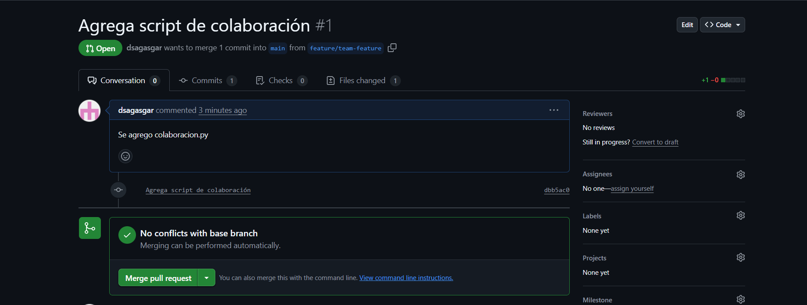
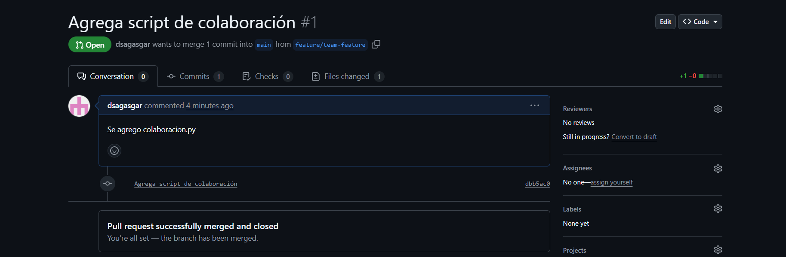

# Introducción a Git conceptos básicos y operaciones esenciales
## git config
Sirve para establecer o consultar datos de identificación como nombre y email. Se pueden establecer a nivel 'system'(todos los usuarios y todos los repositorios), a nivel 'global'(todos los repositorios) y a nivel local(solo a un repositorio).
## git init
Sirve para inicializar un repositorio, crea el directorio .git donde se registran todos lo necesario para que el repositorio cumpla sus funciones.
## git add
El repositorio no registra los cambios automáticamente, para esta tarea existe el comando git add, sirve añadir los cambios al repositorio. Se pueden agregar cambios específicos o agregar todos los cambios realizados.
## git commit
Sirve para agrupar un conjunto de cambios realizados y registrarlos con un mensaje y un identificador. Nos sirve para poder volver a este punto de la historia del repositorio.
## git log
Sirve para visualizar los detalles de los commits del repositorio.

$ git log --graph --pretty=format:'%x09 %h %ar ("%an") %s'
*        db7c23c 19 minutes ago ("sergio") Configura la documentación base del repositorio
*        d560f68 26 minutes ago ("sergio") Commit inicial con README.md
Devuelve un identificador, el tiempo transcurrido desde el commit, el username del autor y el mensaje del commit.
## git branch
Sirve para mostrar las ramas del repositorio y para crear nuevas ramas.
## git checkout/git switch
git checkout sirve para volver a un commit especifico, cambiar ramas, crear y cambiarse a la nueva rama. git switch sirve para cambiar de rama.
# git merge
Sirve para fusionar una rama origen con una rama destino, los cambios que se aplicaron en la ramas origen desde que se creo serán introducidos a la rama destino, si existen inconsistencias se corrigen manualmente.
# git branch -d
Después de aplicar los cambios a la rama destino, es posible que la rama origen ya no tenga uso. Para mantener el repositorio limpio se debe borrar esta rama, para eso sirve el comando `git branch -d`.


Preguntas
- ¿Cómo te ha ayudado Git a mantener un historial claro y organizado de tus cambios?

Con los commits, sirven para agrupar una secuencia de cambios, además están adecuadamente registrados.
- ¿Qué beneficios ves en el uso de ramas para desarrollar nuevas características o corregir errores?

Las ramas son independientes las unas a las otras, crear una nueva rama para desarrollar una nueva característica nos da la libertad de cometer errores sin comprometer el trabajo anterior. Para corregir errores, los errores se pueden detectar después de que se haya avanzado sobre esa implementación, con git podemos crear una rama desde la versión más cercana al momento en el que se generó el problema, y no comprometer lo que se ha avanzado a partir de ese punto.
- Realiza una revisión final del historial de commits para asegurarte de que todos los cambios se han registrado correctamente.

```
c301444 (HEAD -> master) Agrega main.py
db7c23c Configura la documentación base del repositorio
d560f68 Commit inicial con README.md
```
- Revisa el uso de ramas y merges para ver cómo Git maneja múltiples líneas de desarrollo.

```
$ git branch -h
usage: git branch [<options>] [-r | -a] [--merged] [--no-merged]
   or: git branch [<options>] [-f] [--recurse-submodules] <branch-name> [<start-point>]
   or: git branch [<options>] [-l] [<pattern>...]
   or: git branch [<options>] [-r] (-d | -D) <branch-name>...
   or: git branch [<options>] (-m | -M) [<old-branch>] <new-branch>
   or: git branch [<options>] (-c | -C) [<old-branch>] <new-branch>
   or: git branch [<options>] [-r | -a] [--points-at]
   or: git branch [<options>] [-r | -a] [--format]

git merge -h
usage: git merge [<options>] [<commit>...]
   or: git merge --abort
   or: git merge --continue
```
## Ejercicios
### Ejercicio 1 (Manejo avanzado de ramas y resolución de conflictos)
Objetivo: Practicar la creación, fusión y eliminación de ramas, así como la resolución de conflictos que puedan surgir durante la fusión.
Instrucciones:
1. Crea una nueva rama llamada feature/advanced-feature desde la rama main:
```
$ git branch feature/advanced-feature
$ git checkout feature/advanced-feature
$ git branch
* feature/advanced-feature
  master
```
2. Modificar archivos en la nueva rama:
```
#Editar main.py
$ git add main.py
$ git commit -m "Agrega la funcion greet como función avanzada"
[feature/advanced-feature eb1062a] Agrega la funcion greet como función avanzada
 1 file changed, 4 insertions(+)
```
3. Simular un desarrollo paralelo en la rama main.
```
$ git checkout master
Switched to branch 'master'
#Editar main.py
$ git add main.py
$ git commit -m "Actualizar el mensaje main.py en la rama master"
[master cd1a7e7] Actualizar el mensaje main.py en la rama master
 1 file changed, 1 insertion(+), 1 deletion(-)
```
4. Intentar fusionar la rama feature/advanced-feature en master.
```
$ git merge feature/advanced-feature
Auto-merging main.py
CONFLICT (content): Merge conflict in main.py
Automatic merge failed; fix conflicts and then commit the result.
```
5. Resolver el conflicto de fusión:
```
#Resolver conflicto generado en el archivo main.py
$ git add main.py
$ git commit -m "Resuelve el conflicto de fusión entre la versión main y feature/advanced-feature"
[master d8c2e86] Resuelve el conflicto de fusión entre la versión main y feature/advanced-feature
```
6. Eliminar la rama fusionada.
```
$ git branch -d feature/advanced-feature
Deleted branch feature/advanced-feature (was eb1062a).
```
### Ejercicio 2(Exploración y manipulación del historial de commits)
Objetivo: Aprender a navegar y manipular el historial de commits usando comandos avanzados de Git.
1. Ver el historial detallado de commits.
```
$ git log -p
commit d8c2e86802a867b21a4af9e884b7d796b82b7527 (HEAD -> master)
Merge: cd1a7e7 eb1062a
Author: sergio <sergio@example.com>
Date:   Sun Sep 14 19:49:56 2025 -0500

    Resuelve el conflicto de fusión entre la versión main y feature/advanced-feature

commit cd1a7e7f377fdb25c69348ea2f7fe1a3aaf7f83b
Author: sergio <sergio@example.com>
Date:   Sun Sep 14 19:43:06 2025 -0500

    Actualizar el mensaje main.py en la rama master

diff --git a/main.py b/main.py
index df1dc68..3b4d580 100644
--- a/main.py
+++ b/main.py
@@ -1 +1 @@
-print('Hello World')
+print('Hello World-actualizado en master')

commit eb1062a0202e18875680d435a308e96ae81ac15b
Author: sergio <sergio@example.com>
Date:   Sun Sep 14 19:38:34 2025 -0500

    Agrega la funcion greet como función avanzada

diff --git a/main.py b/main.py
index df1dc68..62cdb7b 100644
--- a/main.py
+++ b/main.py
@@ -1 +1,5 @@
 print('Hello World')
+def greet():
+    print('Hello como una función avanzada')
+
+greet()

commit c30144484bc90c04f4950378d071d6a5c38144bf
Author: sergio <sergio@example.com>
Date:   Sun Sep 14 17:56:02 2025 -0500

    Agrega main.py

diff --git a/main.py b/main.py
new file mode 100644
index 0000000..df1dc68
--- /dev/null
+++ b/main.py
@@ -0,0 +1 @@
+print('Hello World')

commit db7c23c64e8b53eb136b7e2f8470619b95f8ead4
Author: sergio <sergio@example.com>
Date:   Sun Sep 14 17:34:06 2025 -0500

    Configura la documentación base del repositorio

diff --git a/CONTRIBUTING.md b/CONTRIBUTING.md
new file mode 100644
index 0000000..2e8cc63
--- /dev/null
+++ b/CONTRIBUTING.md
@@ -0,0 +1 @@
+ CONTRIBUTING
diff --git a/README.md b/README.md
index 2772834..159a628 100644
--- a/README.md
+++ b/README.md
@@ -1 +1,3 @@
  README
+
+Bienvenido al proyecto

commit d560f683d37a3b4c53e79a26d8ed9793834ca368
Author: sergio <sergio@example.com>
Date:   Sun Sep 14 17:26:51 2025 -0500

    Commit inicial con README.md

diff --git a/README.md b/README.md
new file mode 100644
index 0000000..2772834
--- /dev/null
+++ b/README.md
@@ -0,0 +1 @@
+ README
```
2. Filtrar commits por autor
```
$ git log --author="sergio"
Merge: cd1a7e7 eb1062a
Author: sergio <sergio@example.com>
Date:   Sun Sep 14 19:49:56 2025 -0500

    Resuelve el conflicto de fusión entre la versión main y feature/advanced-feature

commit cd1a7e7f377fdb25c69348ea2f7fe1a3aaf7f83b
Author: sergio <sergio@example.com>
Date:   Sun Sep 14 19:43:06 2025 -0500

    Actualizar el mensaje main.py en la rama master

commit eb1062a0202e18875680d435a308e96ae81ac15b
Author: sergio <sergio@example.com>
Date:   Sun Sep 14 19:38:34 2025 -0500

    Agrega la funcion greet como función avanzada

commit c30144484bc90c04f4950378d071d6a5c38144bf
Author: sergio <sergio@example.com>
Date:   Sun Sep 14 17:56:02 2025 -0500

    Agrega main.py

commit db7c23c64e8b53eb136b7e2f8470619b95f8ead4
Author: sergio <sergio@example.com>
Date:   Sun Sep 14 17:34:06 2025 -0500

    Configura la documentación base del repositorio

commit d560f683d37a3b4c53e79a26d8ed9793834ca368
Author: sergio <sergio@example.com>
Date:   Sun Sep 14 17:26:51 2025 -0500

    Commit inicial con README.md
```
3. Revertir un commit.
```
$ git revert HEAD
error: commit d8c2e86802a867b21a4af9e884b7d796b82b7527 is a merge but no -m option was given.
fatal: revert failed
$ git revert -m 1 HEAD
#<nano
Revert "Resuelve el conflicto de fusión entre la versión main y feature/advanced-feature"

This reverts commit d8c2e86802a867b21a4af9e884b7d796b82b7527, reversing
changes made to eb1062a0202e18875680d435a308e96ae81ac15b.

# Please enter the commit message for your changes. Lines starting
# with '#' will be ignored, and an empty message aborts the commit.
#
# On branch master
# Changes to be committed:
#       modified:   main.py
#
Este es el commit de revert del HEAD
#nano>
[master 11800b8] Revert "Resuelve el conflicto de fusión entre la versión main y feature/advanced-feature"
 1 file changed, 2 deletions(-)
$ git log --oneline
ubuntu1@LAPTOP-V377DISR:~/Desktop/desarrollo-de-software/actividad6$ git log --oneline
11800b8 (HEAD -> master) Revert "Resuelve el conflicto de fusión entre la versión main y feature/advanced-feature"
d8c2e86 Resuelve el conflicto de fusión entre la versión main y feature/advanced-feature
cd1a7e7 Actualizar el mensaje main.py en la rama master
eb1062a Agrega la funcion greet como función avanzada
c301444 Agrega main.py
db7c23c Configura la documentación base del repositorio
d560f68 Commit inicial con README.md
```
4. Rebase interactivo.
```
$ git rebase -i HEAD~3
#<nano
pick cd1a7e7 Actualizar el mensaje main.py en la rama master
squash eb1062a Agrega la funcion greet como función avanzada
squash 11800b8 Revert "Resuelve el conflicto de fusión entre la versión main y feature/advanced-feature"
#nano>
Auto-merging main.py
CONFLICT (content): Merge conflict in main.py
error: could not apply eb1062a... Agrega la funcion greet como función avanzada
hint: Resolve all conflicts manually, mark them as resolved with
hint: "git add/rm <conflicted_files>", then run "git rebase --continue".
hint: You can instead skip this commit: run "git rebase --skip".
hint: To abort and get back to the state before "git rebase", run "git rebase --abort".
Could not apply eb1062a... Agrega la funcion greet como función avanzada
#Solucionar conflictos en main.py
$ git add main.py
$ git rebase --continue
#<nano
# This is a combination of 2 commits.
# This is the 1st commit message:

Actualizar el mensaje main.py en la rama master

# This is the commit message #2:

Agrega la funcion greet como función avanzada

# Please enter the commit message for your changes. Lines starting
# with '#' will be ignored, and an empty message aborts the commit.
#
# Date:      Sun Sep 14 19:43:06 2025 -0500
#
# interactive rebase in progress; onto c301444
# Last commands done (2 commands done):
#    pick cd1a7e7 Actualizar el mensaje main.py en la rama master
#    squash eb1062a Agrega la funcion greet como función avanzada
# Next command to do (1 remaining command):
#    squash 11800b8 Revert "Resuelve el conflicto de fusión entre la versión main y feature/advanced-feature"
# You are currently rebasing branch 'master' on 'c301444'.
#
# Changes to be committed:
#       modified:   main.py
#
Este es el mensaje del commit resultante de la mezcla de los commits
#nano>
[detached HEAD 789bb49] Actualizar el mensaje main.py en la rama master
 Date: Sun Sep 14 19:43:06 2025 -0500
 1 file changed, 6 insertions(+)
Auto-merging main.py
CONFLICT (content): Merge conflict in main.py
error: could not apply 11800b8... Revert "Resuelve el conflicto de fusión entre la versión main y feature/advanced-feature"
hint: Resolve all conflicts manually, mark them as resolved with
hint: "git add/rm <conflicted_files>", then run "git rebase --continue".
hint: You can instead skip this commit: run "git rebase --skip".
hint: To abort and get back to the state before "git rebase", run "git rebase --abort".
Could not apply 11800b8... Revert "Resuelve el conflicto de fusión entre la versión main y feature/advanced-feature"
#Solucionar conflictos en main.py
$ git add main.py
$ git rebase --continue
Successfully rebased and updated refs/heads/master.
```
5. Visualización gráfica del historial.
```
$ git log --graph --oneline --all
* 789bb49 (HEAD -> master) Actualizar el mensaje main.py en la rama master
* c301444 Agrega main.py
* db7c23c Configura la documentación base del repositorio
* d560f68 Commit inicial con README.md
```
### Ejercicio 3(Creación y gestión de ramas desde commits específico)
Objetivo: Practicar la creación de ramas desde commits específicos y comprender cómo Git maneja las referencias históricas.
1. Crea una nueva rama desde un commit específico.
```
ubuntu1@LAPTOP-V377DISR:~/Desktop/desarrollo-de-software/actividad6$ git log --oneline
789bb49 (HEAD -> master) Actualizar el mensaje main.py en la rama master
c301444 Agrega main.py
db7c23c Configura la documentación base del repositorio
d560f68 Commit inicial con README.md
ubuntu1@LAPTOP-V377DISR:~/Desktop/desarrollo-de-software/actividad6$ git branch bugfix/rollback-feature c301444
ubuntu1@LAPTOP-V377DISR:~/Desktop/desarrollo-de-software/actividad6$ git checkout bugfix/rollback-feature
Switched to branch 'bugfix/rollback-feature'
ubuntu1@LAPTOP-V377DISR:~/Desktop/desarrollo-de-software/actividad6$ git branch
* bugfix/rollback-feature
  master
```
2. Modificar y confirmar cambios en la nueva rama.
```
ubuntu1@LAPTOP-V377DISR:~/Desktop/desarrollo-de-software/actividad6$ git add main.py
ubuntu1@LAPTOP-V377DISR:~/Desktop/desarrollo-de-software/actividad6$ git commit -m "Corregir error en la funcionalidad de rollback"
[bugfix/rollback-feature abc079f] Corregir error en la funcionalidad de rollback
 1 file changed, 3 insertions(+)
```
3. Fusionar los cambios en la rama principal.
```
ubuntu1@LAPTOP-V377DISR:~/Desktop/desarrollo-de-software/actividad6$ git checkout master
Switched to branch 'master'
ubuntu1@LAPTOP-V377DISR:~/Desktop/desarrollo-de-software/actividad6$ git merge bugfix/rollback-feature
Auto-merging main.py
CONFLICT (content): Merge conflict in main.py
Automatic merge failed; fix conflicts and then commit the result.
## Corregir conflictos manualmente
ubuntu1@LAPTOP-V377DISR:~/Desktop/desarrollo-de-software/actividad6$ git add main.py
ubuntu1@LAPTOP-V377DISR:~/Desktop/desarrollo-de-software/actividad6$ git status
On branch master
All conflicts fixed but you are still merging.
  (use "git commit" to conclude merge)

Changes to be committed:
        modified:   main.py

ubuntu1@LAPTOP-V377DISR:~/Desktop/desarrollo-de-software/actividad6$ git commit -m "Conflictos corregidos en main.py"
[master dfaf92a] Conflictos corregidos en main.py
```
4. Explorar el historial después de la fusión.
```
ubuntu1@LAPTOP-V377DISR:~/Desktop/desarrollo-de-software/actividad6$ git log --graph --oneline
*   dfaf92a (HEAD -> master) Conflictos corregidos en main.py
|\
| * abc079f (bugfix/rollback-feature) Corregir error en la funcionalidad de rollback
* | 789bb49 Actualizar el mensaje main.py en la rama master
|/
* c301444 Agrega main.py
* db7c23c Configura la documentación base del repositorio
* d560f68 Commit inicial con README.md
```
5. Eliminar la rama bugfix/rollback-feature.
```
ubuntu1@LAPTOP-V377DISR:~/Desktop/desarrollo-de-software/actividad6$ git branch
  bugfix/rollback-feature
* master
ubuntu1@LAPTOP-V377DISR:~/Desktop/desarrollo-de-software/actividad6$ git branch -d bugfix/rollback-feature
Deleted branch bugfix/rollback-feature (was abc079f).
ubuntu1@LAPTOP-V377DISR:~/Desktop/desarrollo-de-software/actividad6$ git branch
* master
```
### Ejercicio 4(Manipulación y restauración de commits con git reset y git restore)
Objetivo: Comprender cómo usar git reset y git restore para deshacer cambios en el historial y en el área de trabajo.
1. Hacer cambios en el main.py.
```
ubuntu1@LAPTOP-V377DISR:~/Desktop/desarrollo-de-software/actividad6$ git add main.py
ubuntu1@LAPTOP-V377DISR:~/Desktop/desarrollo-de-software/actividad6$ git commit -m "Introduce un cambio para restablecer"
[master 2fc2a79] Introduce un cambio para restablecer
 1 file changed, 1 insertion(+), 1 deletion(-)
```
2. Usar git reset para deshacer el commit.
```
ubuntu1@LAPTOP-V377DISR:~/Desktop/desarrollo-de-software/actividad6$ git reset --hard HEAD~1
HEAD is now at dfaf92a Conflictos corregidos en main.py
ubuntu1@LAPTOP-V377DISR:~/Desktop/desarrollo-de-software/actividad6$ git log --oneline
dfaf92a (HEAD -> master) Conflictos corregidos en main.py
abc079f Corregir error en la funcionalidad de rollback
789bb49 Actualizar el mensaje main.py en la rama master
c301444 Agrega main.py
db7c23c Configura la documentación base del repositorio
d560f68 Commit inicial con README.md
```
3. Usar git restore para deshacer cambios no confirmados.
```
ubuntu1@LAPTOP-V377DISR:~/Desktop/desarrollo-de-software/actividad6$ echo "Agrega linea en README" >> README.md
ubuntu1@LAPTOP-V377DISR:~/Desktop/desarrollo-de-software/actividad6$ git status
On branch master
Changes not staged for commit:
  (use "git add <file>..." to update what will be committed)
  (use "git restore <file>..." to discard changes in working directory)
        modified:   README.md

no changes added to commit (use "git add" and/or "git commit -a")
ubuntu1@LAPTOP-V377DISR:~/Desktop/desarrollo-de-software/actividad6$ git restore README.md
ubuntu1@LAPTOP-V377DISR:~/Desktop/desarrollo-de-software/actividad6$ git status
On branch master
nothing to commit, working tree clean
```
### Ejercicio 5(Trabajo colaborativo y manejo de Pull Requests)
Objetivo: Simular un flujo de trabajo colaborativo utilizando ramas y pull requests.
1. Crear un nuevo repositorio remoto.
```
ubuntu1@LAPTOP-V377DISR:~/Desktop/desarrollo-de-software$ git clone https://github.com/dsagasgar/repositorio-remoto
Cloning into 'repositorio-remoto'...
warning: You appear to have cloned an empty repository.
```
2. Crea una rama para desarrollo de una característica.
```
ubuntu1@LAPTOP-V377DISR:~/Desktop/desarrollo-de-software/repositorio-remoto$ git branch feature/team-feature
ubuntu1@LAPTOP-V377DISR:~/Desktop/desarrollo-de-software/repositorio-remoto$ git checkout feature/team-feature
Switched to branch 'feature/team-feature'
```
3. Realizar cambios y enviar la rama al repositorio remoto.
```
ubuntu1@LAPTOP-V377DISR:~/Desktop/desarrollo-de-software/repositorio-remoto$ git add .
ubuntu1@LAPTOP-V377DISR:~/Desktop/desarrollo-de-software/repositorio-remoto$ git commit -m "Agrega script de colaboración"
[feature/team-feature dbb5ac0] Agrega script de colaboración
 1 file changed, 1 insertion(+)
 create mode 100644 colaboracion.py
ubuntu1@LAPTOP-V377DISR:~/Desktop/desarrollo-de-software/repositorio-remoto$ git push origin feature/team-feature
Enumerating objects: 6, done.
Counting objects: 100% (6/6), done.
Delta compression using up to 12 threads
Compressing objects: 100% (3/3), done.
Writing objects: 100% (6/6), 510 bytes | 510.00 KiB/s, done.
Total 6 (delta 0), reused 0 (delta 0), pack-reused 0
To https://github.com/dsagasgar/repositorio-remoto
 * [new branch]      feature/team-feature -> feature/team-feature
```
4. Abrir un pull request.

5. Revisar y fusionar pull request.

6. Eliminar la rama remota y local.
```
ubuntu1@LAPTOP-V377DISR:~/Desktop/desarrollo-de-software/repositorio-remoto$ git branch -D feature/te
am-feature
Deleted branch feature/team-feature (was dbb5ac0).
```
### Ejercicio 6(Cherry-Picking y Git Stash)
Objetivo: Aprender a aplicar commits específicos a otra rama utilizando git cherry-pick y a guardar temporalmente cambios no confirmados utilizando git stash.
1. Hacer cambios en main.py y confirmarlos.
```
ubuntu1@LAPTOP-V377DISR:~/Desktop/desarrollo-de-software/actividad6$ git add main.py
ubuntu1@LAPTOP-V377DISR:~/Desktop/desarrollo-de-software/actividad6$ git commit -m "Agrega ejemplo de cherry-pick"
[master b8439c9] Agrega ejemplo de cherry-pick
 1 file changed, 1 insertion(+)
```
2. Crear una nueva rama y aplicar el commit específico.
```
ubuntu1@LAPTOP-V377DISR:~/Desktop/desarrollo-de-software/actividad6$ git branch feature/cherry-pick
ubuntu1@LAPTOP-V377DISR:~/Desktop/desarrollo-de-software/actividad6$ git checkout feature/cherry-pick
Switched to branch 'feature/cherry-pick'
ubuntu1@LAPTOP-V377DISR:~/Desktop/desarrollo-de-software/actividad6$ git cherry-pick b8439c9
On branch feature/cherry-pick
You are currently cherry-picking commit b8439c9.
  (all conflicts fixed: run "git cherry-pick --continue")
  (use "git cherry-pick --skip" to skip this patch)
  (use "git cherry-pick --abort" to cancel the cherry-pick operation)

nothing to commit, working tree clean
The previous cherry-pick is now empty, possibly due to conflict resolution.
If you wish to commit it anyway, use:

    git commit --allow-empty

Otherwise, please use 'git cherry-pick --skip'
```
3. Guardar temporalmente cambios no confirmados.
```
ubuntu1@LAPTOP-V377DISR:~/Desktop/desarrollo-de-software/actividad6$ echo "Este cambio está en el stash" >> main.py
ubuntu1@LAPTOP-V377DISR:~/Desktop/desarrollo-de-software/actividad6$ git status
On branch master
Changes not staged for commit:
  (use "git add <file>..." to update what will be committed)
  (use "git restore <file>..." to discard changes in working directory)
        modified:   main.py

no changes added to commit (use "git add" and/or "git commit -a")
ubuntu1@LAPTOP-V377DISR:~/Desktop/desarrollo-de-software/actividad6$ git stash
Saved working directory and index state WIP on master: b8439c9 Agrega ejemplo de cherry-pick
ubuntu1@LAPTOP-V377DISR:~/Desktop/desarrollo-de-software/actividad6$ git status
On branch master
nothing to commit, working tree clean
```
4. Aplicar los cambios guardados.
```
ubuntu1@LAPTOP-V377DISR:~/Desktop/desarrollo-de-software/actividad6$ git status
On branch master
nothing to commit, working tree clean
ubuntu1@LAPTOP-V377DISR:~/Desktop/desarrollo-de-software/actividad6$ echo 'mas cambios' >> README.md
ubuntu1@LAPTOP-V377DISR:~/Desktop/desarrollo-de-software/actividad6$ git status
On branch master
Changes not staged for commit:
  (use "git add <file>..." to update what will be committed)
  (use "git restore <file>..." to discard changes in working directory)
        modified:   README.md

no changes added to commit (use "git add" and/or "git commit -a")
ubuntu1@LAPTOP-V377DISR:~/Desktop/desarrollo-de-software/actividad6$ git add README.md
ubuntu1@LAPTOP-V377DISR:~/Desktop/desarrollo-de-software/actividad6$ git status
On branch master
Changes to be committed:
  (use "git restore --staged <file>..." to unstage)
        modified:   README.md

ubuntu1@LAPTOP-V377DISR:~/Desktop/desarrollo-de-software/actividad6$ git stash pop
On branch master
Changes to be committed:
  (use "git restore --staged <file>..." to unstage)
        modified:   README.md

Changes not staged for commit:
  (use "git add <file>..." to update what will be committed)
  (use "git restore <file>..." to discard changes in working directory)
        modified:   main.py

Dropped refs/stash@{0} (33a66774dbc45d452556afe231140395c7437b13)
```
5. Revisar el historial y confirmar la correcta aplicación de los cambios.
```
ubuntu1@LAPTOP-V377DISR:~/Desktop/desarrollo-de-software/actividad6$ git add .
ubuntu1@LAPTOP-V377DISR:~/Desktop/desarrollo-de-software/actividad6$ git commit -m "cambios en main.py y readme"
[master 5027549] cambios en main.py y readme
 2 files changed, 2 insertions(+)
ubuntu1@LAPTOP-V377DISR:~/Desktop/desarrollo-de-software/actividad6$ git log
commit 5027549fe4ecb6ee053830bb8dd8d6b0ceb05e88 (HEAD -> master)
Author: sergio <sergio@example.com>
Date:   Sun Oct 5 09:40:11 2025 -0500

    cambios en main.py y readme

commit b8439c9c36fd2a6f021202f0e2ec17bfda534f2f (feature/cherry-pick)
Author: sergio <sergio@example.com>
Date:   Sun Oct 5 09:20:59 2025 -0500

    Agrega ejemplo de cherry-pick

commit dfaf92a7b698eefc65acdb1cf1438ae4ba8a0957
Merge: 789bb49 abc079f
Author: sergio <sergio@example.com>
Date:   Sun Oct 5 07:48:59 2025 -0500

    Conflictos corregidos en main.py

commit abc079f6f900d1244b57a3d92c2bab4c93de253b
Author: sergio <sergio@example.com>
Date:   Sun Oct 5 07:43:26 2025 -0500

    Corregir error en la funcionalidad de rollback

commit 789bb4959ab7e6a4f350dfd6c6e39d3a0c0998aa
:
```


